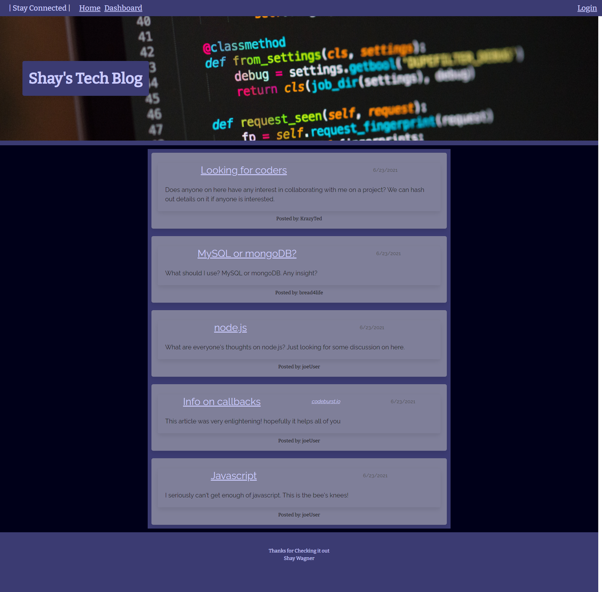
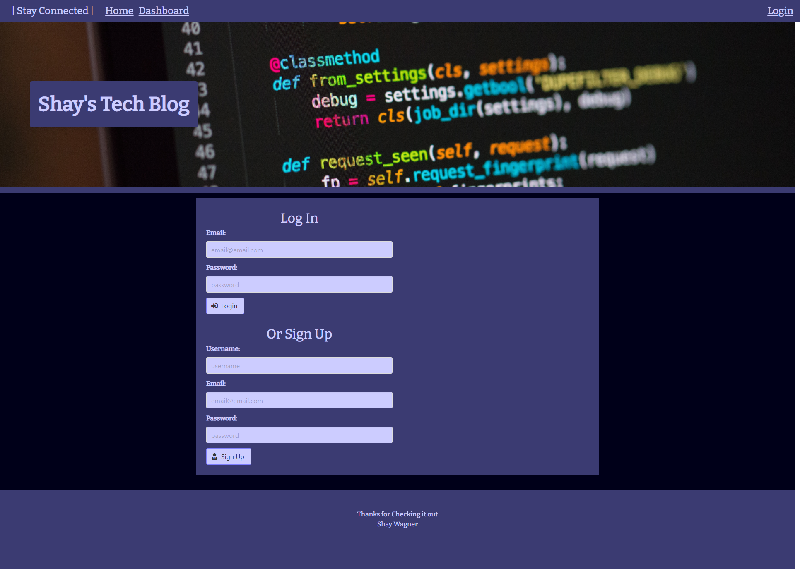
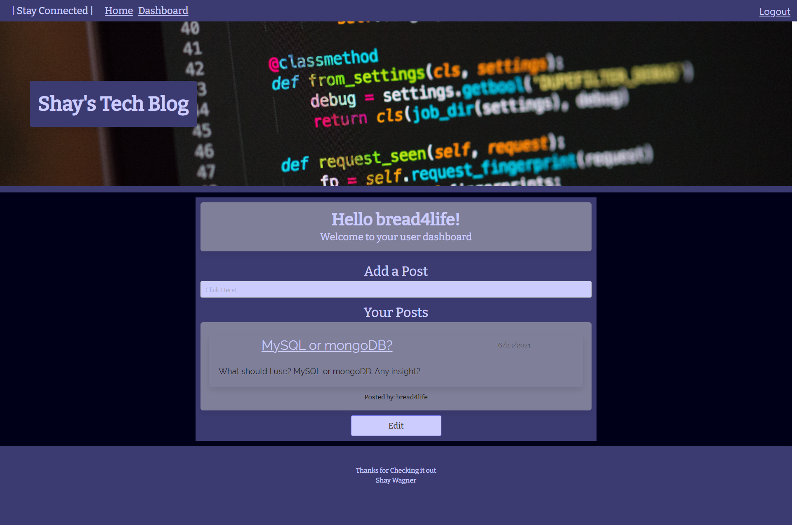
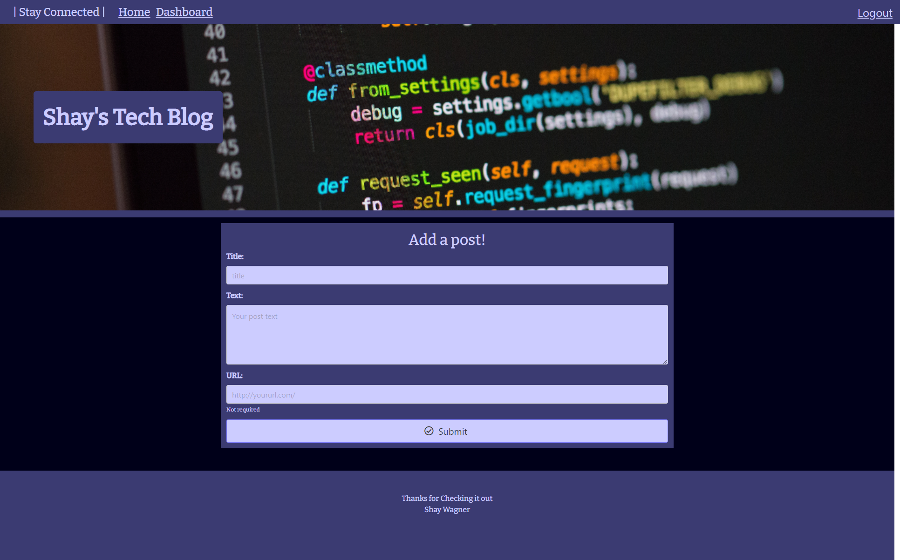
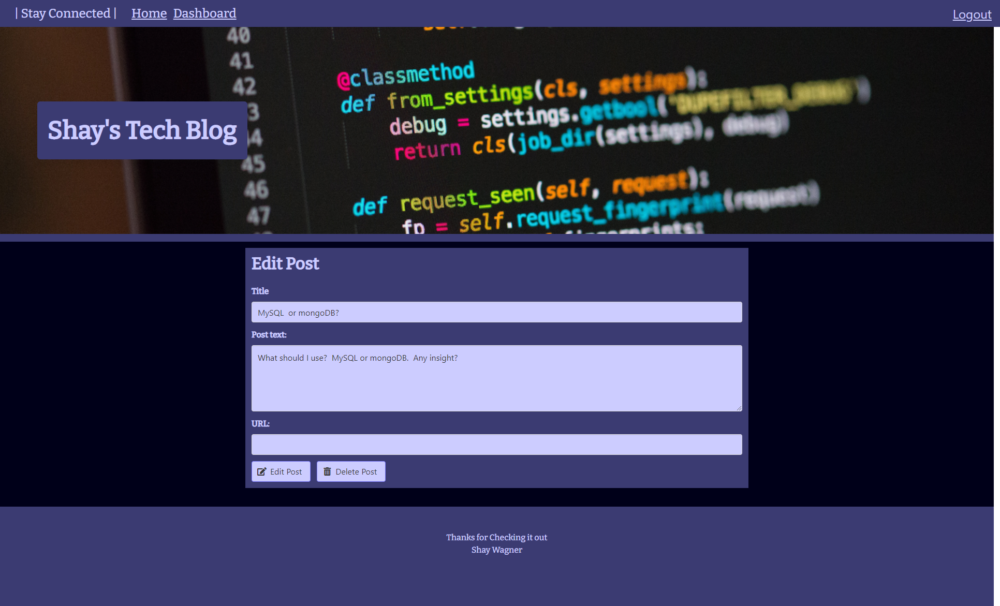

# Shay's Tech Blog

## Description
This project is a blog site for users to connect and discuss tech topics as well as share online articles with eachother. The code is a demonstration on MVC architecture.  MVC is a great way to separate concerns. In this project nearly every feature is abstracted away from each other. This paradigm will make it relatively easy to expand on any of the features of this project. Some of these features include signing up and logging in, adding posts, commenting on posts, and editing/deleting posts.
## Table of Contents
  * [Installation](#Installation)
  * [Usage](#Usage)
  * [Contribution](#Contribution)
  * [Contact](#Questions)
## Installation
This application is deployed live on Heroku. [Click on this link to be taken to it](https://morning-island-64657.herokuapp.com/).
To install this appliction locally, first clone the code onto your machine. You will need to run the command ``npm i``. The packages used in this code are;
* express
* mysql2 
* sequelize  
* express-handlebars 
* express-session 
* connect-session-sequelize 
* bcrypt 
* dotenv
  - You will have to add your own environmental variables to connect to your MySQL database.
## Usage
Using this application is very straightforward. You can view posts when you are not logged in. You can either login or signup on the login page. To reach it simply click on the login link on the navbar located at the top of the window. When logged in you have access to your user dashboard. To reach it click on the dashboard button on the navbar at the top of the page. On your user dashboard you can view all of the posts you made as well as edit and delete posts. To do so click on the "edit" button underneath the post you would like to edit or delete. To edit the post simply change the information on the form that you would like to update and submit. To delete that post click on the "delete" button. You will  then be taken back to your user dashboard. To view comments and discuss a post, click on the title of the post. You will be taken to the page for that single post. There you can fill the textarea with the text of your comment and click on the comment button to send it. You will see the comment added to the discussion on that post.  Finally, to log out click on the log out button on the navbar and you will be logged out. While logged out you can still view posts on the homepage. Please view the screenshots below for examples.

## Contribution
I don't expect any collaboration

## Questions
GitHub: srwagner916 
Email: <srwagner916@gmail.com>
